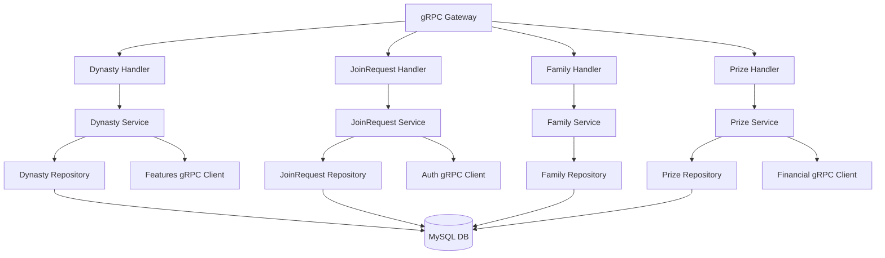

# Dynasty Service Implementation Plan

## Overview

Implement a complete dynasty-service to handle dynasty creation/management, family membership join requests, children permission controls, and dynasty prize redemption. The service will expose gRPC APIs and integrate with features-service, auth-service, notifications-service, and financial-service.

## Architecture

## Database Schema

Based on Laravel migrations, implement these tables:**dynasties**: id, user_id, feature_id, created_at, updated_at**families**: id, dynasty_id, created_at, updated_at**family_members**: id, user_id, family_id, relationship (owner/father/mother/offspring/spouse/brother/sister), created_at, updated_at**join_requests**: id, from_user, to_user, status (0=pending, 1=accepted, -1=rejected), relationship, message, created_at, updated_at**dynasty_permissions**: id, user_id, verified, BFR, SF, W, JU, DM, PIUP, PITC, PIC, ESOO, COTB (all boolean), created_at, updated_at**received_prizes**: id, user_id, prize_id, message, created_at, updated_at**dynasty_prizes**: id, member (relationship), psc, satisfaction, introduction_profit_increase, accumulated_capital_reserve, data_storage**dynasty_messages**: id, type, message (template with placeholders)

## Implementation Phases

### Phase 1: Database Models & Repositories

**Goal**: Establish database schema and repository layer

- Create database models in [`services/dynasty-service/internal/models/`](services/dynasty-service/internal/models/)
- `dynasty.go`: Dynasty model with user_id, feature_id
- `family.go`: Family model with dynasty_id
- `family_member.go`: FamilyMember model with relationships
- `join_request.go`: JoinRequest model with status enum
- `permission.go`: DynastyPermission model with all permission flags
- `received_prize.go`: ReceivedPrize model
- `dynasty_message.go`: DynastyMessage templates
- Implement repositories in [`services/dynasty-service/internal/repository/`](services/dynasty-service/internal/repository/)
- `dynasty_repository.go`: CRUD + GetByUserID, CheckFeatureHasPendingRequest
- `family_repository.go`: CRUD + GetByDynastyID, GetMemberCount, FindMemberByUserAndFamily
- `join_request_repository.go`: CRUD + GetSentRequests, GetReceivedRequests, GetLatestRequest, UpdateStatus
- `permission_repository.go`: CRUD + GetByUserID, GetDefaultPermissions, UpdatePermission
- `prize_repository.go`: CRUD + GetUserPrizes, GetPrizeByMember
- `message_repository.go`: GetByType for template retrieval
- Create database migration script in [`scripts/dynasty_schema.sql`](scripts/dynasty_schema.sql)

### Phase 2: Core Dynasty Service

**Goal**: Implement dynasty creation, retrieval, and feature updates

- Expand [`services/dynasty-service/internal/service/dynasty_service.go`](services/dynasty-service/internal/service/dynasty_service.go)
- `CreateDynasty(ctx, userID, featureID)`: Create dynasty, family, add owner as member, send notification
- `GetDynastyByUserID(ctx, userID)`: Return dynasty or nil
- `GetDynastyByID(ctx, dynastyID)`: Retrieve by ID
- `UpdateDynastyFeature(ctx, dynastyID, featureID, userID)`: Switch feature, handle debt creation if changed within 30 days, lock previous feature
- `GetUserFeatures(ctx, userID, excludeFeatureID)`: Fetch residential features from features-service
- `GetFeatureDetails(ctx, featureID)`: Get property details from features-service
- Implement authorization policies in [`services/dynasty-service/internal/policy/dynasty_policy.go`](services/dynasty-service/internal/policy/dynasty_policy.go)
- `CanCreate(user, feature)`: Check ownership, verification, residential karbari, no pending requests
- `CanUpdate(user, dynasty, feature)`: Check ownership, feature differs, no pending requests
- Update handlers in [`services/dynasty-service/internal/handler/dynasty_handler.go`](services/dynasty-service/internal/handler/dynasty_handler.go)
- Complete `CreateDynasty`, `GetUserDynasty`, `UpdateDynastyFeature` with full business logic
- Add intro prizes when user has no dynasty
- Integrate Jalali date formatting
- Add gRPC client for features-service in [`services/dynasty-service/internal/client/features_client.go`](services/dynasty-service/internal/client/features_client.go)

### Phase 3: Join Request Lifecycle

**Goal**: Implement sending, accepting, rejecting join requests

- Implement [`services/dynasty-service/internal/service/join_request_service.go`](services/dynasty-service/internal/service/join_request_service.go)
- `SendJoinRequest(ctx, fromUserID, toUserID, relationship, message, permissions)`: Validate, create request, set offspring permissions if under 18, send notifications to both users
- `GetSentRequests(ctx, userID, pagination)`: Paginate sent requests with prize details
- `GetReceivedRequests(ctx, userID, pagination)`: Paginate received requests
- `GetJoinRequest(ctx, requestID, userID)`: Get single request with authorization
- `AcceptJoinRequest(ctx, requestID, userID)`: Update status=1, create family_member, award prize, verify/create permissions for minors, notify both parties
- `RejectJoinRequest(ctx, requestID, userID)`: Update status=-1, notify both parties
- `DeleteJoinRequest(ctx, requestID, userID)`: Delete pending request (status=0 only)
- `GetDefaultPermissions(ctx, relationship)`: Return default template for offspring
- `SearchUsers(ctx, searchTerm)`: Call auth-service user search
- Implement validation logic in [`services/dynasty-service/internal/validation/family_validator.go`](services/dynasty-service/internal/validation/family_validator.go)
- Validate relationship enum (father, mother, offspring, spouse, brother, sister)
- Check user verification status
- Enforce relationship caps: single parent, single spouse, max 4 siblings, max 4 offspring
- Check for duplicate/rejected/pending requests
- Validate permissions array for offspring (10 required keys)
- Forbid permission setting for adult offspring
- Implement authorization policies in [`services/dynasty-service/internal/policy/join_request_policy.go`](services/dynasty-service/internal/policy/join_request_policy.go)
- `CanView(user, joinRequest)`: Either sender or receiver
- `CanDelete(user, joinRequest)`: Sender only, pending status
- `CanAccept(user, joinRequest)`: Receiver only, pending status
- `CanReject(user, joinRequest)`: Receiver only, pending status
- Create message template helpers in [`services/dynasty-service/internal/service/message_service.go`](services/dynasty-service/internal/service/message_service.go)
- Replace placeholders: [sender-code], [receiver-code], [relationship], [created_at], [sender-name], [receiver-name]
- Support templates: requester_confirmation_message, receiver_message, requester_accept_message, receiver_accept_message, receiver_reject_message, requester_reject_message
- Update handlers in [`services/dynasty-service/internal/handler/join_request_handler.go`](services/dynasty-service/internal/handler/join_request_handler.go)
- Implement all JoinRequestService gRPC methods
- Add pagination support
- Include prize metadata in responses
- Integrate with auth-service for user search in [`services/dynasty-service/internal/client/auth_client.go`](services/dynasty-service/internal/client/auth_client.go)
- Integrate with notifications-service in [`services/dynasty-service/internal/client/notification_client.go`](services/dynasty-service/internal/client/notification_client.go)

### Phase 4: Family Management & Children Permissions

**Goal**: Implement family member listing and permission controls

- Implement [`services/dynasty-service/internal/service/family_service.go`](services/dynasty-service/internal/service/family_service.go)
- `GetFamily(ctx, familyID, dynastyID)`: Verify dynasty-family binding, return family with members
- `GetFamilyMembers(ctx, familyID, pagination)`: Return paginated members with user info
- `GetFamilyMemberCount(ctx, familyID)`: Count for dynasty response
- Implement [`services/dynasty-service/internal/service/permission_service.go`](services/dynasty-service/internal/service/permission_service.go)
- `SetChildPermission(ctx, childUserID, parentUserID, permissionKey, status)`: Toggle single permission flag
- `CreateDefaultPermissions(ctx, userID, verified)`: Initialize all permissions for under-18 user
- `VerifyPermissions(ctx, userID)`: Mark permissions as verified
- `GetUserPermissions(ctx, userID)`: Fetch current permission state
- Implement authorization in [`services/dynasty-service/internal/policy/family_policy.go`](services/dynasty-service/internal/policy/family_policy.go)
- `CanControlPermissions(parent, child)`: Parent cannot target self, child must be under 18, child must be in parent's dynasty family
- Update handlers in [`services/dynasty-service/internal/handler/family_handler.go`](services/dynasty-service/internal/handler/family_handler.go)
- Implement GetFamily, GetFamilyMembers with pagination
- Add SetChildPermissions with validation (10 permission keys: BFR, SF, W, JU, DM, PIUP, PITC, PIC, ESOO, COTB)
- Include permissions in FamilyMember response only for under-18 members
- Add helper to check user age via auth-service

### Phase 5: Dynasty Prize System

**Goal**: Implement prize listing and redemption

- Implement [`services/dynasty-service/internal/service/prize_service.go`](services/dynasty-service/internal/service/prize_service.go)
- `GetUserPrizes(ctx, userID, pagination)`: List unclaimed prizes for user
- `GetPrize(ctx, prizeID, userID)`: Get single prize with message
- `ClaimPrize(ctx, prizeID, userID)`: Award PSC (divided by Variable::getRate('psc')), add satisfaction to wallet, amplify variables (referral_profit, data_storage, withdraw_profit), delete receipt
- `AwardPrize(ctx, userID, relationship, message)`: Create received_prize record based on relationship
- Integrate with financial-service in [`services/dynasty-service/internal/client/financial_client.go`](services/dynasty-service/internal/client/financial_client.go)
- `IncrementWalletPSC(userID, amount)`
- `IncrementSatisfaction(userID, amount)`
- `AmplifyVariable(userID, variableName, multiplier)`
- `GetVariableRate(key string)`: Fetch PSC conversion rate
- Update handlers in [`services/dynasty-service/internal/handler/prize_handler.go`](services/dynasty-service/internal/handler/prize_handler.go)
- Implement GetPrizes, GetPrize, ClaimPrize
- Format prize values: satisfaction/profit/reserve/storage scaled by *100 for percentage display
- Add message field only in GetPrize (route-specific)
- Ensure atomic transactions for prize redemption (wallet + variables + delete)

### Phase 6: Integration & Testing

**Goal**: Wire up all components and validate functionality

- Update [`services/dynasty-service/cmd/server/main.go`](services/dynasty-service/cmd/server/main.go)
- Register all gRPC services
- Initialize all repositories, services, policies
- Configure clients for features-service, auth-service, financial-service, notifications-service
- Create comprehensive tests in [`tests/dynasty/`](tests/dynasty/)
- Unit tests for each service layer
- Policy tests for authorization rules
- Integration tests for complete flows
    - Dynasty creation → join request → accept → family member exists
    - Offspring permissions → parent toggles permission → verify update
    - Prize redemption → wallet updated → prize deleted
    - Feature update within 30 days → debt created → feature locked
- Add validation tests
- Relationship caps enforcement
- Duplicate request prevention
- Permission validation for offspring
- Status checks for accept/reject/delete
- Test edge cases
- Accepting request for under-18 father (should create default permissions)
- Accepting request where acceptor is under-18 offspring (verify existing permissions)
- Rapid feature changes (debt + lock handling)
- Concurrent prize redemption (should fail with 404 on second attempt)

### Phase 7: HTTP Gateway Routes

**Goal**: Expose REST endpoints via grpc-gateway

- Update [`services/grpc-gateway/routes.go`](services/grpc-gateway/routes.go) to add dynasty routes:
- `GET /api/dynasty` → GetUserDynasty
- `POST /api/dynasty/create/{feature}` → CreateDynasty (add account.security middleware)
- `POST /api/dynasty/{dynasty}/update/{feature}` → UpdateDynastyFeature (add account.security)
- `GET /api/dynasty/{dynasty}/family/{family}` → GetFamilyMembers
- `GET /api/dynasty/requests/sent` → GetSentRequests
- `GET /api/dynasty/requests/sent/{joinRequest}` → GetJoinRequest
- `DELETE /api/dynasty/requests/sent/{joinRequest}` → DeleteJoinRequest (account.security)
- `POST /api/dynasty/add/member/get/permissions` → GetDefaultPermissions
- `POST /api/dynasty/add/member` → SendJoinRequest (account.security)
- `POST /api/dynasty/search` → SearchUsers
- `GET /api/dynasty/requests/received` → GetReceivedRequests
- `GET /api/dynasty/requests/received/{joinRequest}` → GetJoinRequest
- `POST /api/dynasty/requests/received/{joinRequest}` → AcceptJoinRequest (account.security)
- `DELETE /api/dynasty/requests/received/{joinRequest}` → RejectJoinRequest (account.security)
- `GET /api/dynasty/prizes` → GetPrizes
- `GET /api/dynasty/prizes/{recievedPrize}` → GetPrize
- `POST /api/dynasty/prizes/{recievedPrize}` → ClaimPrize
- `POST /api/dynasty/children/{user}` → SetChildPermissions
- Add middleware stack: `auth:sanctum`, `verified`, `activity` for all routes
- Add `account.security` middleware for sensitive mutations

### Phase 8: Monitoring & Documentation

**Goal**: Add observability and finalize documentation

- Add Prometheus metrics in [`services/dynasty-service/internal/metrics/`](services/dynasty-service/internal/metrics/)
- Dynasty creation count
- Join request sent/accepted/rejected counts
- Prize redemption count
- Permission toggle count
- Add structured logging with context
- Log all policy authorization decisions
- Log all external service calls (features, auth, financial, notifications)
- Log validation failures
- Update API documentation in [`api-docs/dynasty-service/`](api-docs/dynasty-service/)
- Add gRPC method signatures
- Document error codes
- Add sequence diagrams for complex flows (join request lifecycle)
- Create operational runbook in [`services/dynasty-service/README.md`](services/dynasty-service/README.md)
- Service dependencies
- Configuration variables
- Common troubleshooting scenarios
- Database migration procedures

## Key Technical Decisions

1. **Jalali Date Formatting**: Use [`github.com/yaa110/go-persian-calendar`](https://github.com/yaa110/go-persian-calendar) for consistent Y/m/d and H:i formatting
2. **Status Enum**: Represent join request status as int32 (0=pending, 1=accepted, -1=rejected)
3. **Relationship Enum**: Use string enum validated against fixed list
4. **Permission Storage**: Store as individual boolean columns (not JSON) for querying
5. **Transaction Boundaries**: Wrap CreateDynasty (dynasty+family+member), AcceptJoinRequest (status+member+permissions+prize), ClaimPrize (wallet+variables+delete) in DB transactions
6. **Debt Handling**: Create debt record via financial-service when feature changed within 30 days
7. **Locked Features**: Create locked_feature record to prevent reuse for 1 month
8. **Prize Scaling**: PSC divided by Variable::getRate('psc'), percentages multiplied by 100 for display
9. **Notification Templates**: Fetch from dynasty_messages table and replace placeholders at runtime
10. **Policy Enforcement**: Run all policies in service layer before repository mutations

## Dependencies

- **features-service**: GetUserFeatures, GetFeatureDetails, CheckFeaturePendingRequest
- **auth-service**: SearchUsers, GetUserDetails, CheckVerification, GetUserAge, GetProfilePhoto
- **financial-service**: IncrementWallet, CreateDebt, AmplifyVariables, GetVariableRate
- **notifications-service**: SendNotification (DynastyCreated, FeatureChanged, JoinRequest sent/accepted/rejected)

## Migration Strategy

1. Deploy dynasty-service alongside Laravel API
2. Test all endpoints in isolation
3. Switch Kong routes to dynasty-service one endpoint at a time